# GitHub Copilot Usage Extended Insights Dashboard

A full-stack analytics dashboard that visualizes GitHub Copilot usage data with extended organizational visibility.

### What it does:
- Displays Copilot usage metrics: active users, chat requests, code suggestions, acceptance rates
- Shows data by IDE, chat mode, AI model, and timeframe (7/14/28 days)
- Provides **team-level analytics** by importing team/org data from GitHub
- Aggregates individual user metrics to team and organization levels
- Includes an AI chatbot for natural language queries about the data

### Key features:
- **Familiar design** - styled to match the native GitHub Copilot usage dashboard for easy adoption
- Dashboard with interactive charts (Recharts)
- Table views: Summary, Detailed Report, Query Builder, Teams View
- **Acceptance rate sorting** - adjust user license/tier by their usage performance
- **Nested team/org views** - drill into users within teams and organizations with hierarchical visibility
- **License management insights** - identify usage patterns for:
  - License removal candidates (low/no usage)
  - License tier adjustments (Copilot Business 300 → Enterprise 1000 premium requests)
  - Cost center allocation for specific users
- **Search & filter** - searchbox support across all table views
- Teams & Organizations import (CSV/JSON) with nested membership support
- People page linking users to their teams
- Dark/light theme toggle

---

## Related Tools

### GitHub Users, Teams & Organizations Exporter
**[github-users-teams-export](https://github.com/benarch/github-users-teams-export)**

A companion tool that exports GitHub users, teams, and organizations data. Use this to:
- Import users into the **Teams** tab for team-level analytics
- Add extended visibility on users, team membership, and nested team/organization membership
- Map Copilot usage data to organizational structure

### GitHub Copilot Usage Anonymizer
**[github-copilot-usage-anonymizer](https://github.com/benarch/github-copilot-usage-anonymizer)**

A data anonymization tool used to generate the demo data in this project. It:
- Anonymizes Copilot usage data by replacing real user names with generated names
- Preserves data structure and relationships while protecting privacy
- Enables safe sharing and demonstration of Copilot analytics without exposing actual user identities

---

## Screenshots

### Detailed Report - Table View

*Search, filter, and sort users by interactions, code generation, acceptances, and lines of code metrics*

### Code Generation Insights

*Total suggestions, acceptance rates, code completions trends, and lines of code added/deleted*

### Model Usage Analytics

*Model usage per day, chat model distribution, and model usage per chat mode breakdown*

> **📸 Want to see all dashboard views?** Check out the complete screenshots gallery in [app-screenshots/README.md](app-screenshots/README.md)

---

## Tech Stack

| Layer | Technologies |
|-------|--------------|
| **Frontend** | React 18+, TypeScript, Tailwind CSS, Vite, Recharts, TanStack Query |
| **Backend** | Express.js, TypeScript, SQLite (better-sqlite3), OpenAPI/Swagger |
| **DevOps** | Docker & Docker Compose |

---

## Getting Started

### Local Development

```bash
# Clone the repository
git clone https://github.com/benarch/github-copilot-usage-extended.git
cd github-copilot-usage-extended

# Install dependencies
npm run install:all

# Seed database with sample data
npm run db:seed

# Start development servers
npm run dev
```

- **Frontend:** http://localhost:3000
- **API:** http://localhost:3001
- **API Docs:** http://localhost:3001/api-docs

### Docker Deployment

```bash
# Build and start containers
docker compose up -d --build

# Or run in foreground to see logs
docker compose up --build
```

- **Web Dashboard:** http://localhost:3010
- **API:** http://localhost:3001

### Stopping the Application

```bash
# Stop Docker containers
docker compose down

# Stop local development (press Ctrl+C in terminal)
```

---

## Importing Data

### Copilot Usage Data (Insights Tab)

You have two options to import GitHub Copilot usage data:

#### Option 1: Direct API Integration (Recommended) 🔄

Fetch data automatically from GitHub's Copilot Metrics API:

**Requirements:**
- GitHub Personal Access Token (PAT) or GitHub App with `copilot` scope
- Organization admin access to view Copilot metrics
- Enterprise or Organization with GitHub Copilot enabled

**Setup Instructions:**
1. **Create a Personal Access Token:**
   - Go to GitHub → Settings → Developer settings → Personal access tokens → Fine-grained tokens
   - Generate new token with the following permissions:
     - **Organization permissions:** Copilot (read)
     - Select your organization
   - Or use a GitHub App with the `organization_copilot_seat_management:read` permission
2. **Configure the application:**
   - Set environment variable: `GITHUB_TOKEN=your_token_here`
   - Set organization name: `GITHUB_ORG=your_org_name`
3. **Sync data:**
   - Navigate to the Settings/Configuration page in the dashboard
   - Click "Sync from GitHub API" button
   - Or use the API endpoint: `POST /api/usage/sync-from-github`

**Benefits:**
- ✅ Real-time or near real-time data access
- ✅ Automated data refresh (scheduled sync capability)
- ✅ Eliminates manual export/import process
- ✅ Always up-to-date metrics
- ✅ Supports incremental updates
- ✅ No file handling required

**Disadvantages:**
- ❌ Requires GitHub API token with appropriate permissions
- ❌ Subject to GitHub API rate limits (5,000 requests/hour)
- ❌ Needs network connectivity to GitHub
- ❌ Additional security considerations for token storage
- ❌ Only works with GitHub Enterprise Cloud (not available for GitHub.com individual accounts)

#### Option 2: Manual File Import

Import your GitHub Copilot usage data from the native GitHub Copilot usage dashboard:

1. **Export from GitHub:** Go to your organization's GitHub Copilot usage page and use the **Export** option to download usage data
2. **Navigate to Insights tab** in this dashboard
3. **Upload file** using the upload button
4. **Supported formats:**
   - **JSON** - Standard JSON array format
   - **NDJSON** - Newline-delimited JSON (one record per line)

**Benefits:**
- ✅ No API token required
- ✅ Works offline
- ✅ Full control over data
- ✅ No API rate limits

**Disadvantages:**
- ❌ Manual process
- ❌ Data becomes stale over time
- ❌ Requires repeated exports for updates
- ❌ File size limitations

The uploaded data will populate all dashboard views with your organization's Copilot usage metrics.

### Users, Teams & Organizations (Teams Tab)

Import organizational structure from GitHub Enterprise to enable team-level analytics:

1. **Export from GitHub Enterprise:** Use the [github-users-teams-export](https://github.com/benarch/github-users-teams-export) tool to export users, teams, and organizations
2. **Navigate to Teams tab** in this dashboard
3. **Upload file** using the import button
4. **Supported formats:**
   - **JSON** - Standard JSON array format
   - **NDJSON** - Newline-delimited JSON (one record per line)
   - **CSV** - Comma-separated values with header row

Once imported, you can:
- View aggregated Copilot usage by team
- Drill into nested team hierarchies
- See organization-level metrics
- Link individual users to their team membership

---

## Architecture & Flow Diagrams

### Data Import & Application Flow

```mermaid
flowchart TB
    subgraph DataSources["📥 Data Sources"]
        GH_API["GitHub Copilot<br/>Usage API"]
        GH_EXPORT["github-users-teams-export<br/>Tool"]
        ANON["github-copilot-usage-anonymizer<br/>(Demo Data)"]
    end

    subgraph Import["📤 Import Process"]
        JSON_UPLOAD["Upload JSON/CSV<br/>via UI or API"]
        TEAMS_IMPORT["Import Teams &<br/>Organizations"]
        USERS_IMPORT["Import Users with<br/>Team Membership"]
    end

    subgraph Backend["⚙️ Backend (Express + SQLite)"]
        API["REST API<br/>:3001"]
        DB[(SQLite<br/>Database)]
        SEED["Seed Script<br/>npm run db:seed"]
    end

    subgraph Frontend["🖥️ Frontend (React + Vite)"]
        UI["Dashboard UI<br/>:3000"]
        CHARTS["Charts<br/>(Recharts)"]
        TABLES["Table Views"]
        CHATBOT["AI Chatbot"]
    end

    subgraph Features["📊 Analytics Features"]
        OVERVIEW["Overview Dashboard"]
        CODE_GEN["Code Generation<br/>Insights"]
        COPILOT_USAGE["Copilot Usage<br/>Analytics"]
        TEAMS_VIEW["Teams View<br/>Aggregated Metrics"]
        PEOPLE["People Page<br/>User Details"]
        ORGS["Organizations<br/>Nested View"]
    end

    %% Data flow
    GH_API --> JSON_UPLOAD
    GH_EXPORT --> TEAMS_IMPORT
    GH_EXPORT --> USERS_IMPORT
    ANON --> JSON_UPLOAD

    JSON_UPLOAD --> API
    TEAMS_IMPORT --> API
    USERS_IMPORT --> API
    SEED --> DB
    API <--> DB

    API --> UI
    UI --> CHARTS
    UI --> TABLES
    UI --> CHATBOT

    CHARTS --> OVERVIEW
    CHARTS --> CODE_GEN
    CHARTS --> COPILOT_USAGE
    TABLES --> TEAMS_VIEW
    TABLES --> PEOPLE
    TABLES --> ORGS
```



### User Workflow


