# App Screenshots

Screenshots of the GitHub Copilot Usage Insights Dashboard showcasing all major views and features.

---

## Copilot Usage (Dark Mode)
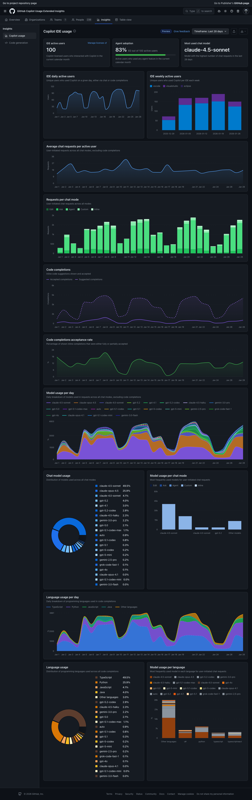
Dashboard showing daily/weekly active users, chat requests per user, model distribution pie chart, and model usage trends over time. Primary analytics view for Copilot adoption metrics.

---

## Copilot Usage (Light Mode)
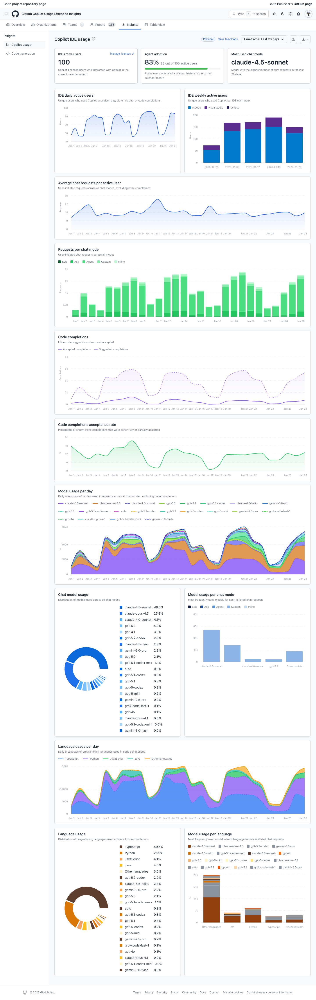
Same Copilot usage dashboard in light theme. Demonstrates theme toggle functionality with bright background and adjusted chart colors for readability.

---

## Code Generation
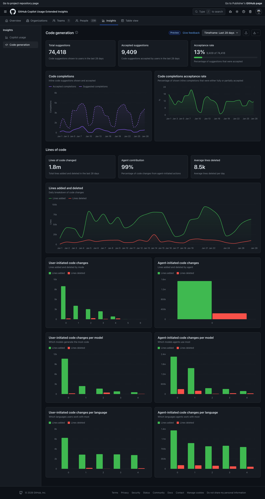
Displays lines of code suggested vs accepted, acceptance rate trends, code completions, and code changes by model/language. Tracks AI-assisted code productivity metrics.

---

## Table View - Summary Report
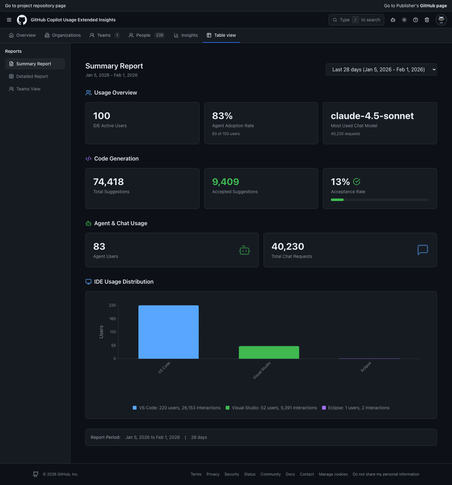
Aggregated summary statistics in tabular format showing total interactions, code generation counts, and acceptance metrics across all users for quick reporting.

---

## Table View - Detailed Report
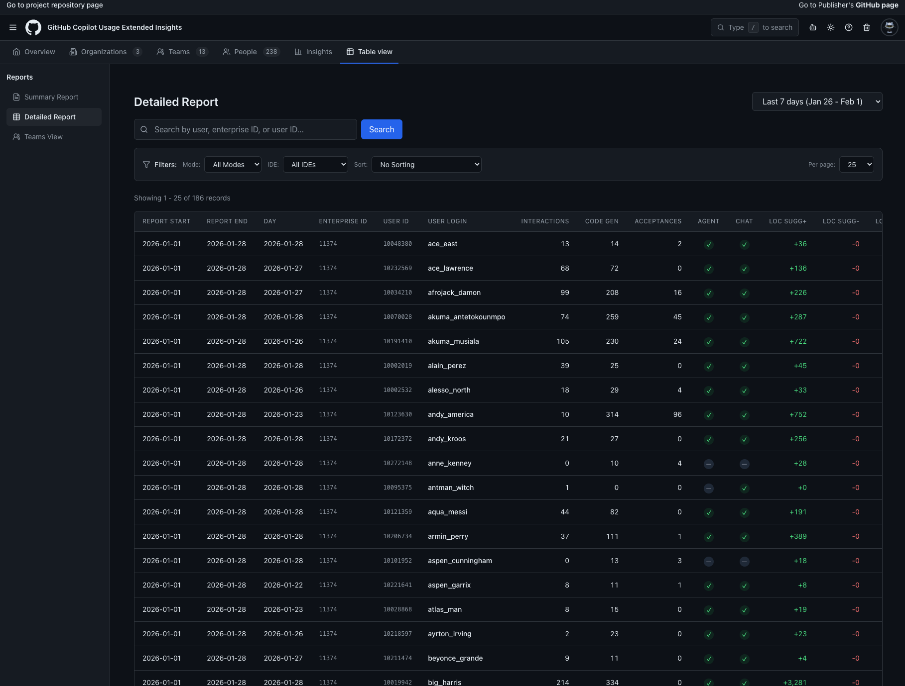
Granular per-user breakdown with columns for interactions, code gen, acceptances, LOC suggested/added/deleted, and IDE usage. Supports search, sort, and pagination.

---

## Table View - Query
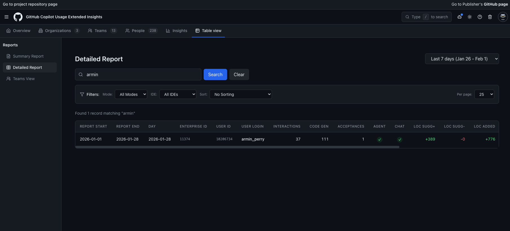
Interactive query interface allowing custom filters and search across the detailed report data. Users can filter by login, IDE, language, or date range.

---

## Organizations
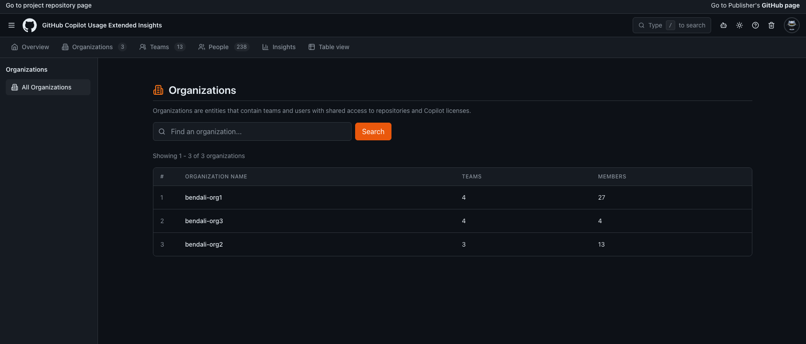
Lists all organizations extracted from imported team data. Shows organization names with member counts. Organizations are parsed from team import files.

---

## Teams - All Teams
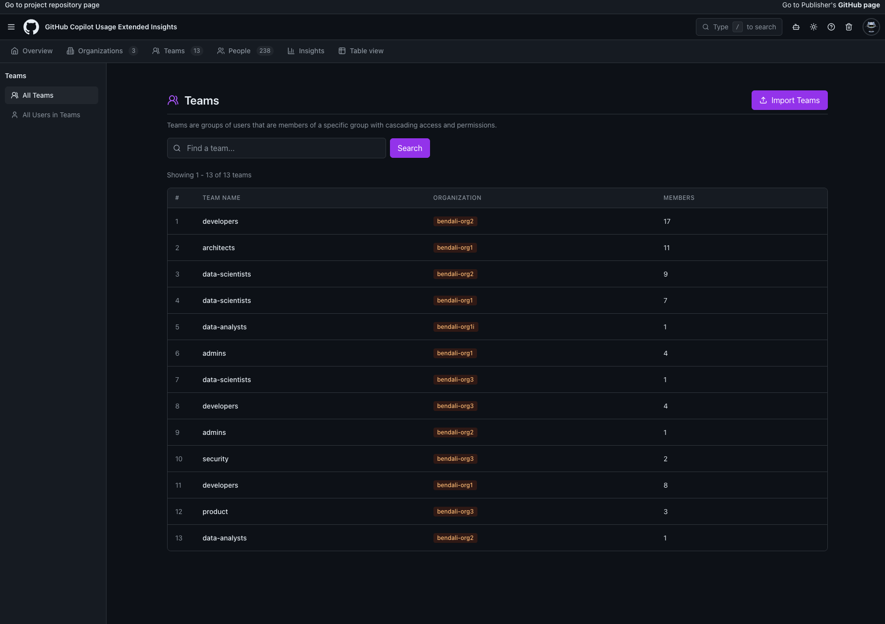
Displays all teams with CSV/JSON import buttons. Shows team names, associated organizations, and member counts. Supports import of user-team mappings.

---

## Teams - All Users in Teams
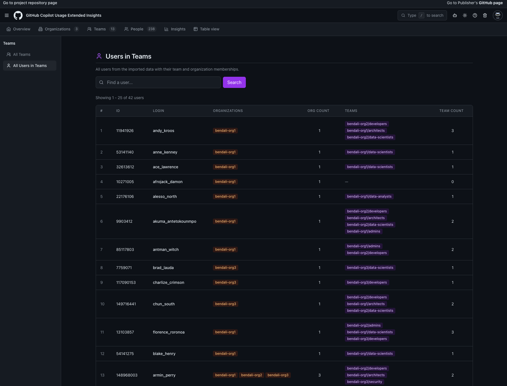
Lists all users from imported data with their team memberships displayed as badges. Shows user login, ID, and all teams they belong to.

---

## People
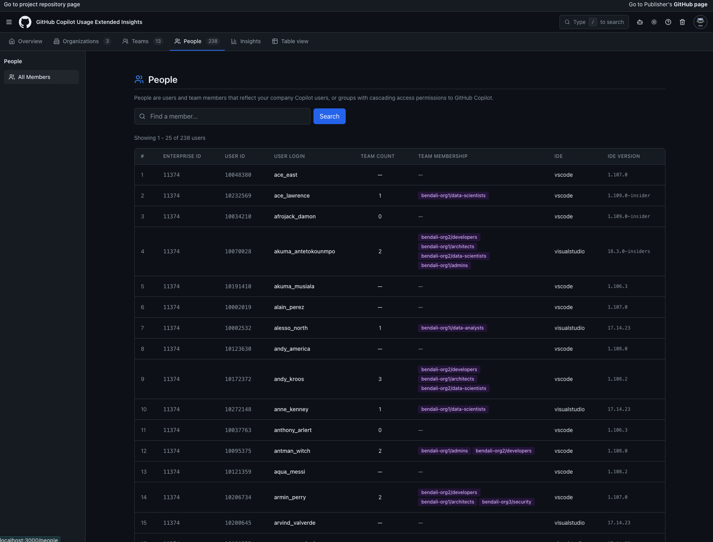
Paginated table of all Copilot users with activity metrics. Shows login, user ID, total interactions, code gen/acceptance counts, and team membership columns.

---

## Table View - Teams View
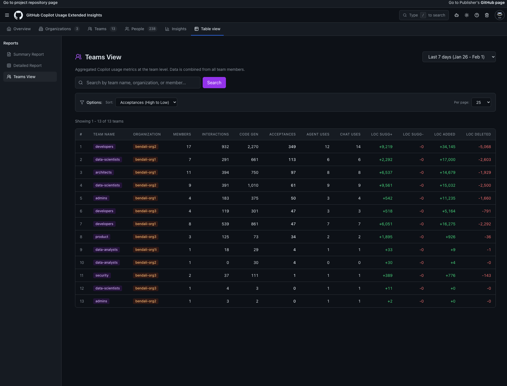
Aggregated team-level metrics combining usage data from all team members. Shows total interactions, code gen, acceptances, and LOC metrics per team.

---

## Chatbot
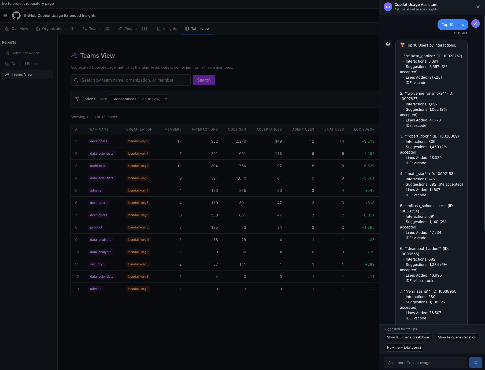
AI-powered assistant panel for natural language queries about usage data. Features suggested query chips and conversational interface for data exploration.

---

## Overview
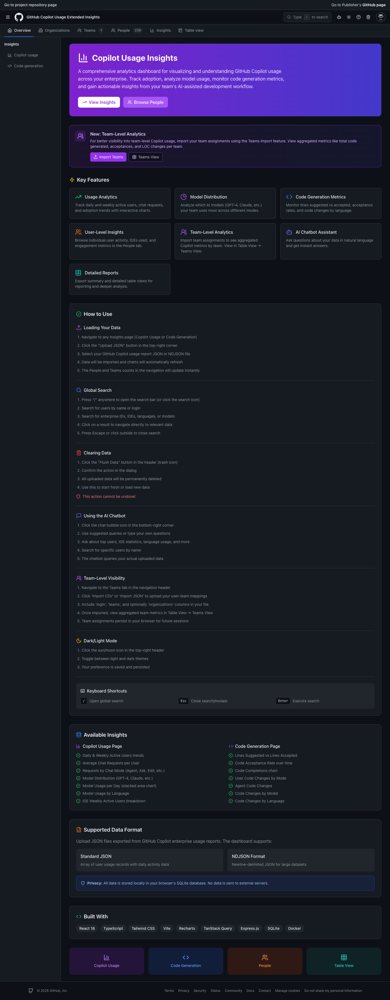
Landing page with feature overview, quick links to all sections, how-to guides, and the "New: Team-Level Analytics" banner promoting the teams import feature.
