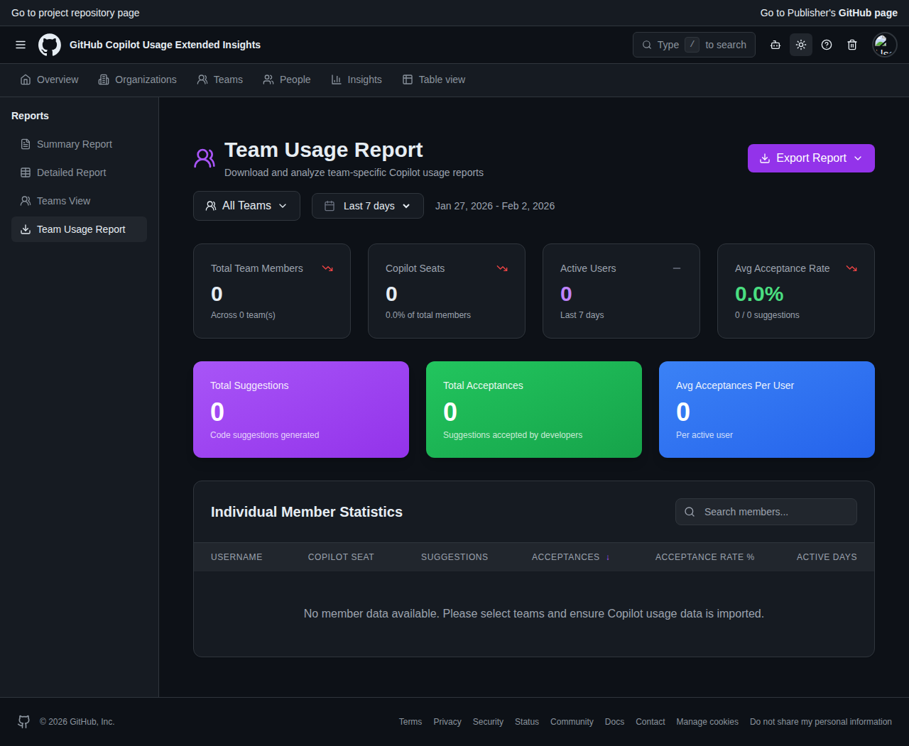

# Team Usage Report Page Screenshots

This directory contains screenshots of the Team Usage Report page in both light and dark modes.

## Light Mode

**Features visible:**
- Team selection dropdown with "All Teams" selector
- Date range picker (Last 7 days)
- Export Report button with dropdown menu
- Summary dashboard with 8 metric cards:
  - Total Team Members with trend indicator
  - Copilot Seats (count and percentage)
  - Active Users
  - Avg Acceptance Rate
  - Total Suggestions (purple gradient card)
  - Total Acceptances (green gradient card)
  - Avg Acceptances Per User (blue gradient card)
- Individual Member Statistics table with:
  - Sortable columns (Username, Copilot Seat, Suggestions, Acceptances, Acceptance Rate %, Active Days)
  - Search functionality
  - Color-coded acceptance rate badges

## Dark Mode

**Features visible:**
- Full dark theme support
- All UI elements properly styled for dark mode
- Gradient cards maintain visibility and appeal
- Table and cards with proper contrast
- Consistent with the rest of the application's dark theme

## Accessing the Page

To access this page in the running application:

1. Navigate to http://localhost:3000
2. Click on "Table view" in the main navigation
3. Select "Team Usage Report" from the sidebar under "Reports"

Or directly: http://localhost:3000/reports/team-usage

## Additional Screenshots

For more screenshots of the application, see the [app-screenshots](../app-screenshots/) directory.
